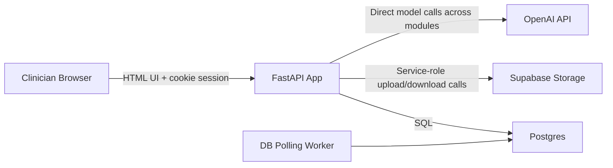
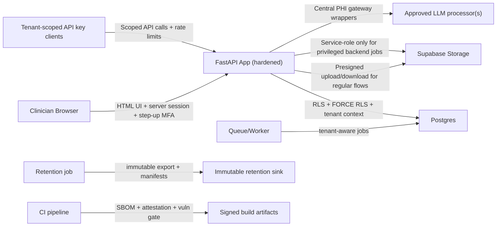
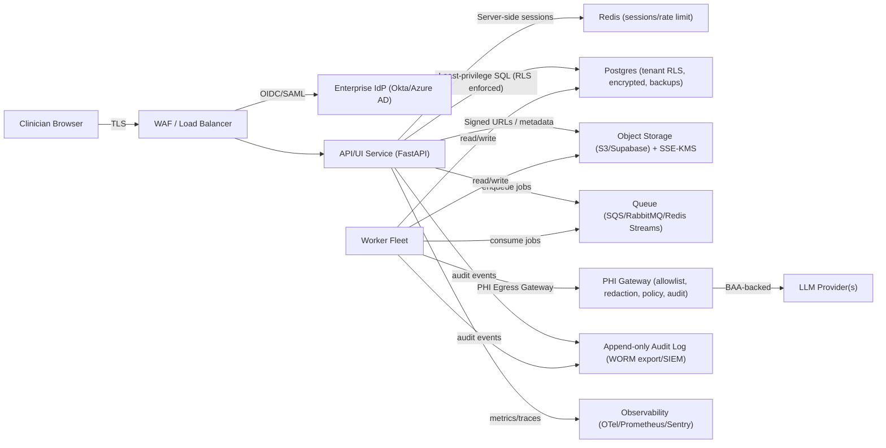

# MedCHR — Enterprise/HIPAA Readiness Review (Codebase)

Date: 2026-02-05  
Repo: `MedCHR.ai`  
Scope reviewed: `backend/app`, `backend/scripts`, `backend/sql`, `frontend/templates`, `Dockerfile`, `run_dev.sh`, docs in `doc/`

This is a **security + compliance engineering** review to help you move toward “enterprise / healthcare-grade” and **HIPAA-aligned** technical safeguards. HIPAA compliance also requires administrative + physical safeguards (policies, training, vendor BAAs, incident response, etc.) that are outside code, but the findings below focus on what’s visible in this repo.

---

## Executive Summary

The project has strong MVP direction and several good security intentions (CSRF tokens, security headers, rate limiting, password hashing, optional malware scanning, HIPAA mode checks). However, it is **not yet enterprise/HIPAA-ready** due to several **deployment-blocking** issues:

1) **Tenant isolation is broken in multiple UI + API routes**, enabling cross-tenant patient/document access if an attacker obtains/guesses IDs or if IDs leak.  
2) **PHI egress controls are inconsistent**: some OpenAI calls bypass `HIPAA_MODE` allowlisting and redaction (Vision OCR, diagnosis suggestions, auditor).  
3) **Database schema/migrations do not match application code**, so deployments are not reproducible and key security properties (tenancy, auditing) can’t be relied on.  
4) **Session management is client-side cookie-based**, and the code stores **MFA setup secrets in the session**, which is unsafe for enterprise.

These are the “must-fix” items before any serious HIPAA posture claim.

Note: the findings section below captures the original review snapshot; implementation status above reflects current remediation progress.

---

## Implementation Status (as of 2026-02-06)

This report’s Phase 0-3 baseline controls have now been implemented in code:
- **DB-level tenant enforcement**: RLS policies + tenant context propagation (`007_tenant_rls.sql` + request/worker context wiring).
- **PHI gateway policy**: centralized LLM wrappers enforce global allowlist + tenant PHI policy and emit `phi_egress_events` (`008_phi_egress_policy.sql`).
- **Identity hardening**: server-side sessions, MFA setup token hardening, step-up MFA for sensitive actions, and SSO scaffolding.
- **Audit hardening**: append-only `audit_events` with immutability/hash chaining trigger (`009_audit_events_immutability.sql`) plus unified event writes.
- **Storage hardening**: presigned upload/download routes for regular document access paths (`/patients/{id}/documents/presign-upload`, `/documents/{id}/download-url`).
- **Audit integrity hardening**: per-tenant chain-state locking (`013_audit_chain_locking.sql`) + verifier script (`verify_audit_chain.py`).
- **Retention hardening**: immutable export sink requirement + `retention_manifests` evidence registry (`014_retention_manifests.sql`).
- **DevSecOps hardening**: pinned dependencies + weekly refresh workflow, SBOM generation, provenance attestation, and migration checksum enforcement.
- **Operational readiness**: runbooks and evidence-pack generator (`generate_evidence_pack.py`) with scheduled controls workflow.

Remaining work is mainly organizational/operational (BAAs, key-rotation runbooks, incident response drills, external SIEM/WORM integrations), not primary code blockers.

---

## Architecture Before vs After

Key notes:
- UI is server-rendered templates under `/ui/*` (Jinja2) with server-side sessions and MFA step-up for sensitive actions.
- API endpoints enforce tenant-scoped API keys, scopes, per-key rate limits, and tenant IP allowlists.
- Audit events are append-only with concurrency-safe chain-state hashing and a verifier utility.
- Retention purge now requires immutable export confirmation and records manifests before deletion.

---

## Findings (Prioritized)

Each finding includes: **Rule ID**, Severity, Location, Evidence, Impact, Fix, and Mitigations.

### [C-01] Broken tenant isolation across UI + API routes (IDOR / cross-tenant access)

**Severity:** Critical  
**Category:** AuthZ / Multi-tenancy / HIPAA access control  

**Where (examples):**
- `backend/app/main.py:1182` — `/ui/patients/{patient_id}/report` fetches patient without tenant constraint
- `backend/app/main.py:1423` — `/ui/patients/{patient_id}/rag` fetches patient without tenant constraint
- `backend/app/main.py:1460` — `/ui/patients/{patient_id}/upload` uploads to patient_id without tenant ownership check
- `backend/app/gap_features.py:37` — `/api/gap/patients/{patient_id}/trends` uses `get_current_user` but does **not** filter by `tenant_id`
- `backend/app/clinical.py:16` — clinical endpoints use API key only and do not enforce tenant

**Evidence (snippets):**
- `backend/app/main.py:1188-1190`
  - `_get_patient(patient_id)` is called **without** `tenant_id=str(user.tenant_id)`.
- `backend/app/main.py:342-349`
  - `_upload_document()` validates patient exists by `id` only: `SELECT id FROM patients WHERE id = %s`.
- `backend/app/gap_features.py:135-138`
  - `SELECT genetics FROM patients WHERE id = %s` (no tenant filter).

**Impact (one sentence):** A logged-in user (or any bearer of an API key) can access or mutate data belonging to other tenants if patient/document IDs are known or leaked, violating HIPAA access control requirements and enterprise SaaS isolation expectations.

**Fix (recommended):**
- Enforce tenant authorization **everywhere**, ideally in two layers:
  1) **Application layer**: central “tenant guard” dependency used by all routes that accept `patient_id` / `document_id` (verify ownership via joins).
  2) **Database layer**: implement **Row Level Security (RLS)** or separate schema/database per tenant, using a **least-privilege DB role** (no bypass).
- Add `tenant_id` to all tenant-scoped tables (documents, extractions, embeddings, lab_results, jobs, etc.) or enforce via joins + RLS policies.

**Mitigations (short-term while refactoring):**
- Immediately patch the obvious endpoints to call `_get_patient(patient_id, tenant_id=str(user.tenant_id))` and ensure document lookups join through patient’s tenant.
- Add tests that assert tenant isolation (attempt access with wrong tenant → 404/403).

---

### [C-02] Client-side session storage + MFA setup secret stored in cookie-session

**Severity:** Critical  
**Category:** AuthN, Session security, MFA

**Where:**
- `backend/app/main.py:703-726` — MFA setup stores secret in `request.session["mfa_setup_secret"]`.
- `backend/app/main.py:622-638` + `backend/app/main.py:33-49` — uses Starlette `SessionMiddleware` (cookie-based sessions).

**Evidence:**
- `backend/app/main.py:723-725`
  - `request.session["mfa_setup_secret"] = secret`

**Impact (one sentence):** If a session cookie is stolen (XSS, device compromise, proxy logs, misconfigured TLS), the attacker can recover the MFA seed during setup and generate valid TOTP codes, undermining MFA.

**Fix (recommended):**
- Move to **server-side sessions** (Redis or DB `user_sessions`) with:
  - session IDs stored in cookies,
  - rotation on login + privilege changes,
  - ability to revoke sessions (logout all devices),
  - binding to device/user-agent signals (optional).
- Never store MFA secrets in client-managed state. Store “pending MFA secret” server-side only (DB/Redis), encrypted at rest.

**Mitigations:**
- If you must keep cookie sessions temporarily: do **not** store `mfa_setup_secret` in the session; store it server-side keyed by a random short-lived token.

---

### [C-03] PHI egress controls bypassed (Vision OCR, diagnosis suggestions, auditor)

**Severity:** Critical  
**Category:** PHI handling, Third-party processors, HIPAA-mode guarantees

**Where:**
- `backend/app/ocr.py:41-48` calls Vision OCR (OpenAI) without PHI processor enforcement.
- `backend/app/vision_ocr.py:25-55` sends medical document images to OpenAI (`model="gpt-4o"`) without `ensure_phi_processor()` and without a HIPAA-mode gate.
- `backend/app/diagnosis_suggester.py:8-105` uses OpenAI directly at import time, bypassing `get_settings()`, `HIPAA_MODE`, and redaction.
- `backend/app/auditor.py:15-51` calls OpenAI without `ensure_phi_processor()` or redaction.

**Evidence:**
- `backend/app/vision_ocr.py:112-133` — sends base64 medical document images to OpenAI.
- `backend/app/diagnosis_suggester.py:8` — legacy direct client initialization pattern (no HIPAA gate).
- `backend/app/auditor.py:16-17` — OpenAI client created directly.

**Impact (one sentence):** In HIPAA-mode deployments you can still accidentally transmit PHI to a non-approved processor (or without redaction), invalidating your intended HIPAA safeguards.

**Fix (recommended):**
- Create a single **LLM/PHI egress gateway module** used by *all* outbound model calls (embeddings, extraction, drafting, audit, diagnosis, vision OCR). It must:
  - enforce `ensure_phi_processor("<vendor>")` in HIPAA mode,
  - apply consistent redaction/de-identification policies (if enabled),
  - implement tenant-aware allowlists (some tenants may disallow AI),
  - log only non-PHI metadata (tokens, latency, model, request_id).
- In HIPAA mode, **disable Vision OCR** unless the vision provider is explicitly approved and BAA-backed. Consider local OCR or a HIPAA-eligible document AI service.

**Mitigations:**
- Add a startup self-test that scans for OpenAI client usage outside the gateway (static import checks) and fails fast in HIPAA mode.

---

### [C-04] Database schema & migrations are inconsistent with code (non-reproducible deploy)

**Severity:** Critical  
**Category:** Reliability, Data security, Compliance readiness

**Where:**
- `backend/scripts/migrate.py:22-47` runs migrations from `backend/sql/migrations/*.sql`.
- Application code expects tables/columns not created by the migrations.

**Evidence (examples):**
- `backend/app/main.py:200-207` inserts into `audit_logs(..., tenant_id)` but `backend/sql/migrations/001_initial.sql:60-67` defines `audit_logs` **without** `tenant_id`.
- `backend/app/auth.py:12-20` expects `users.tenant_id`, but `backend/sql/migrations/004_rbac_users.sql:1-10` creates `users` without `tenant_id` (and without `mfa_enabled/mfa_secret`).
- `backend/sql/migrations/002_hospital_grade.sql:10-48` alters `users` and `tenants`, but those tables are not created earlier in the migration chain, so this migration will fail on a fresh DB.
- `backend/app/gap_features.py:46-58` reads `extractions.service_date`, which is not present in `backend/sql/migrations/001_initial.sql:23-29`.

**Impact (one sentence):** You cannot reliably deploy, audit, or certify controls when the schema is ambiguous and migrations fail or drift.

**Fix (recommended):**
- Establish a single source of truth: **migrations**.
- Make migrations **linear, idempotent, and testable**:
  - ensure `tenants`, `users`, `patients(tenant_id)` are created before any `ALTER TABLE` that assumes them,
  - ensure all tables used by code exist (or remove dead code),
  - add a CI job that spins up Postgres and runs `python -m backend.scripts.init_db` + a minimal smoke test.

**Mitigations:**
- Until migrations are fixed, avoid claiming tenant isolation / auditing in production.

---

### [H-01] API key auth is not tenant-scoped and has no scopes/rotation

**Severity:** High  
**Category:** AuthZ / Integrations / Operational security

**Where:**
- `backend/app/security.py:71-88` — `API_KEYS` is a CSV allowlist of plaintext shared secrets.
- Many API endpoints accept `patient_id`/`document_id` and do not enforce tenant ownership (`backend/app/main.py:235+`, `backend/app/clinical.py`).

**Impact:** Any valid API key can access all tenant data reachable via IDs, and keys cannot be scoped, rotated safely, or audited per tenant/user.

**Fix:**
- Implement an `api_keys` table with:
  - **hashed** keys (store only hashes),
  - `tenant_id`, `scopes`, `created_at`, `revoked_at`, `last_used_at`, `rate_limit`,
  - per-key audit events.
- Bind API key auth to tenant context and enforce tenant in all queries.

---

### [H-02] Audit logging is inconsistent and not tamper-evident

**Severity:** High  
**Category:** HIPAA audit controls

**Evidence:**
- `_log_action()` is defined in `backend/app/main.py:200-207` and used inconsistently (sometimes missing `tenant_id`, sometimes `actor` is a `User` object).
- `backend/app/security_audit.py` describes an integrity-hashed audit log but targets table `audit_log` which does not appear in the migrations.
- `backend/scripts/purge_data.py:50-65` deletes audit logs based on retention without export to WORM storage.

**Fix:**
- Consolidate to a single audit event mechanism:
  - `audit_events` table (append-only) with `tenant_id`, `actor_id`, `resource_type`, `resource_id`, `action`, `outcome`, `ip`, `ua`, `created_at`.
  - prevent UPDATE/DELETE for app role; export to WORM/immutable storage for long-term retention.
- Ensure every PHI access/export/write produces an audit event (view, download, export, share, etc.).

---

### [H-03] Docker image embeds `.env.example` and uses unpinned deps

**Severity:** High  
**Where:**
- `Dockerfile:25` — `COPY .env.example .env`
- `backend/requirements.txt` — unpinned dependencies

**Impact:** Risk of misconfiguration, secrets handling drift, and non-reproducible builds.

**Fix:**
- Do not bake `.env` into the image; inject config via runtime env/secret manager.
- Pin dependencies (lockfile) and add SBOM + vulnerability scanning in CI.

---

### [M-01] OpenAPI docs are exposed by default in production

**Severity:** Medium  
**Where:**
- `backend/app/main.py:49` creates `FastAPI(...)` with default docs enabled.

**Fix:**
- In `APP_ENV=prod` or `HIPAA_MODE=true`, disable docs (`docs_url=None`, `redoc_url=None`, `openapi_url=None`) or restrict them behind admin auth / internal network.

---

### [M-02] Proxy/IP handling affects rate limiting and audit IP accuracy

**Severity:** Medium  
**Where:**
- `backend/app/main.py:46-53` uses SlowAPI `get_remote_address`.
- `doc/K8S_DEPLOYMENT.md:87-88` notes proxy headers but runtime config is not enforced.

**Fix:**
- Enable proxy headers in Uvicorn/Gunicorn and/or add `ProxyHeadersMiddleware`.
- Ensure `X-Forwarded-For` trust is limited to known proxy IPs.

---

### [M-03] Potential open redirect via `Referer`

**Severity:** Medium  
**Where:**
- `backend/app/main.py:792-793` redirects to `referer` header directly.

**Fix:**
- Only allow redirects to same-origin relative paths; fallback to `/ui`.

---

### [L-01] Code quality issues reduce confidence in controls

**Severity:** Low  
**Examples:**
- Duplicate route definition: `backend/app/main.py:796` and `backend/app/main.py:854` both define `/ui/embeddings`.
- Silent exception swallowing: `backend/app/main.py:1733-1734` in admin user create.

**Fix:** Add linting, type checks, and route uniqueness tests; avoid blanket `except: pass`.

---

## Recommended Target Architecture (Enterprise/HIPAA-aligned)

This is a pragmatic “next” architecture that keeps your product shape but adds the missing enterprise controls.

Key differences vs today:
- **Tenant isolation enforced in DB** (RLS + least-privilege role) and in app.
- **Server-side sessions** and centralized IAM (SSO + MFA).
- **Queue-backed jobs**, not DB polling; job payloads avoid PHI.
- **PHI Gateway** centralizes “what can leave the system” and under what rules.
- **Audit trail is append-only** and exported to immutable storage.

---

## Roadmap (Practical Order of Operations)

### Phase 0 — Stop the bleeding (1–2 weeks)
- Fix tenant isolation in *every* route and add tenant-aware helper functions.
- Align schema + migrations to match code (or remove unused modules).
- Centralize OpenAI calls behind a single gateway; disable Vision OCR by default.
- Add unit/integration tests for cross-tenant access attempts.

### Phase 1 — Enterprise identity + sessions (2–4 weeks)
- Implement OIDC SSO (and optionally SAML) with tenant domain mapping.
- Server-side sessions + session revocation, device/session inventory, forced logout.
- MFA hardening (encrypted secrets, backup codes, step-up auth for exports).

### Phase 2 — Audit/monitoring + PHI governance (2–4 weeks)
- Append-only audit events; ensure coverage for PHI read/download/export.
- Structured logging with PHI redaction; metrics + tracing.
- Data retention policies enforced with export to immutable storage before purge.

### Phase 3 — Deployment hardening (ongoing)
- Secrets manager + key rotation; remove `.env` from images.
- SBOM + dependency pinning + SAST/DAST + container scanning.
- Network segmentation, egress controls, WAF, rate limits per tenant.

---

## Notes on HIPAA Compliance (Non-code)

Even with perfect code, HIPAA requires organizational controls:
- **BAAs** with every PHI processor/vendor (cloud provider, LLM provider, storage, monitoring).
- **Risk analysis** + ongoing risk management.
- **Access management** procedures (least privilege, access reviews).
- **Incident response** runbooks and breach notification procedures.
- **Backups/DR** with periodic restore testing.

---

## Next Step (If you want me to implement)

Pick one “Phase 0” item (recommended: **tenant isolation**) and I can implement it end-to-end with tests and a migration plan.
